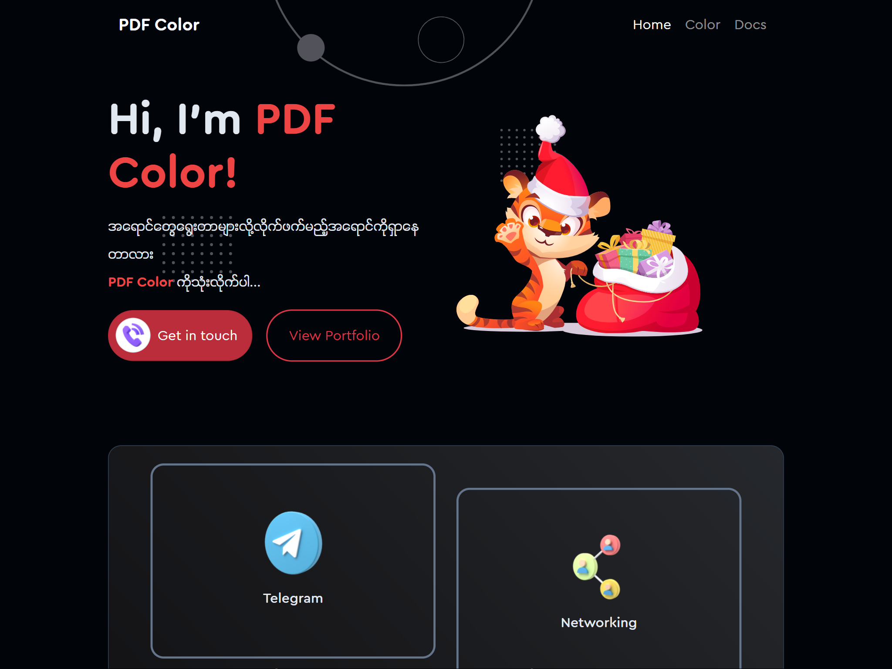

# PDF Color
#### Current Version (v 1.0.0)



- [Live demo](http://sanlinhtik3.github.io/pdf-color)

### Including files:
```html
<link rel="stylesheet" href="pdf-color/css/pdf.css">
```

### Required HTML structure
```html
<div class="pdf-bg-red-100">This is Background Color</div>
<div class="pdf-text-red-100">This is Text Color</div>
<div class="pdf-border-red-100">This is Border Color</div>
```

### CSS
```css
.text {
    color: var(--pdf-red-500);
    background-color: var(--pdf-red-500);
    border-color: var(--pdf-red-500);
}
```

## Donations
Donations would be more than welcome :)

**KBZ Pay** : 09 753 479 007 <br>
**Wave Money** : 09 753 479 007

## Get in touch
Phone: [09 753 479 007](09753479007) <br>
Facebook: https://fb.com/5sanlinhtike
